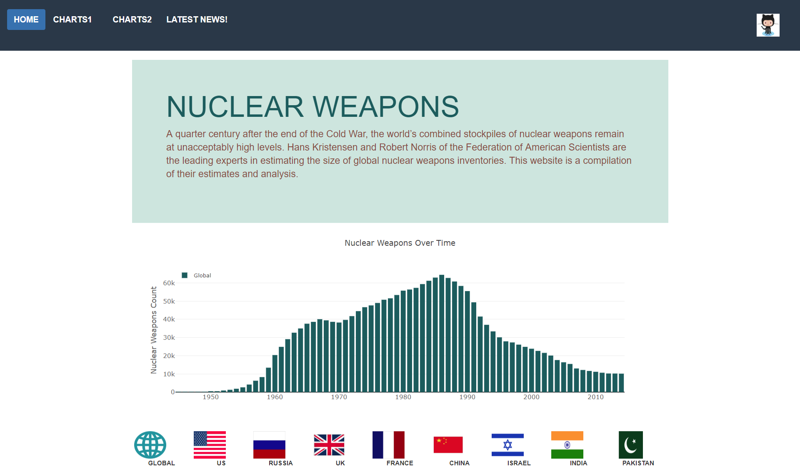

# Nuclear-Warheads
Building an interactive Data Visualization dashboard using Python Flask powered RESTful API, HTML/CSS and JavaScript

# Background
This project is for building an interactive Data Visualization dashboard, showing the development of global nuclear arsenals between 1945 to 2014, the number of nuclear bases of countries with nuclear capabilities and the status of world nuclear forces in 2018.

## Technologies used:
* **Databse**
  * SQLite
* **Data Visualization Libraries**
  * D3.js | Plotly.js
* **Geomapping tools**
  * Leaflet.js | mapbox-gl.js
* **Web Scraping Tools**
  * Beautiful Soup | Splinter | Requests
* **Web Development**
  * Python Flask powered RESTful API | HTML | CSS | Bootstrap | JavaScript

## Datasets/sources that will be used for the project:
* [CNBC webpage](https://www.cnbc.com/2018/07/23/us-and-russia-control-most-of-the-worlds-nuclear-weapons.html)
* [Federation of American Scientists website](https://fas.org/issues/nuclear-weapons/status-world-nuclear-forces/)
* [Global Fire Power website](https://www.globalfirepower.com/countries-listing-nato-members.asp)
* [John Stone's website](http://www.johnstonsarchive.net/nuclear/tests/wrjp205a.html)
* [ourworldindata website](https://ourworldindata.org/nuclear-weapons)
* [international campaign to abolish nuclear weapons website](http://www.icanw.org/the-facts/nuclear-arsenals/)
* SQLite database – warheads_inventories table [Source](https://www.tandfonline.com)
* A csv file listing nuclear base locations of the world’s nuclear-armed countries (will be imported to SQLite database and converted to geoJSON object after adding geographic coordinates of each location) [Source](https://www.tandfonline.com/doi/full/10.1080/00963402.2017.1363995)

# Screenshot of the webpage

